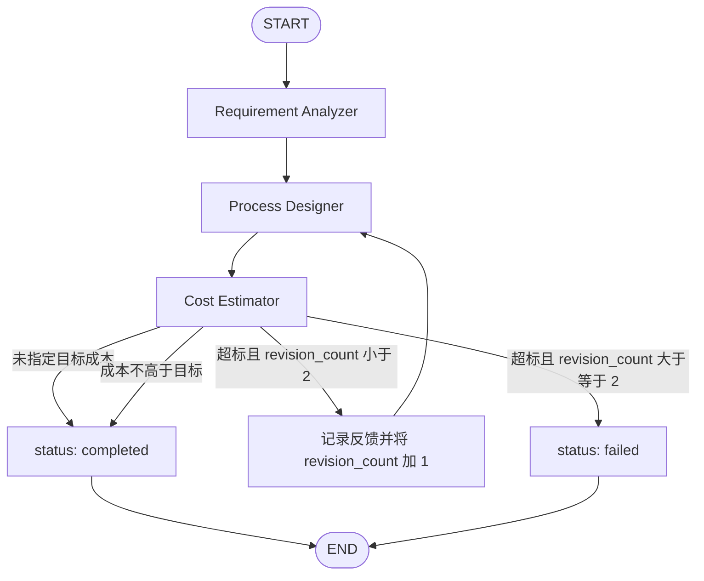

# Multi-Agent Textile Foundry 架构设计

## 1. 系统定位与边界

系统将自然语言面料企划转化为可解释的候选工艺和成本估算。它是个人项目与决策辅助工具，不是实验室检测系统、真实报价平台或可替代纺织工程师的生产决策系统。

Phase 1 只运行于终端并读取本地 JSON。API、Web UI、PostgreSQL 和云部署分别留到后续阶段，避免未验证核心逻辑被外层系统放大。

### 核心不变量

- LLM 负责解析语言、表达不确定性，以及在确定性过滤后的合法候选中组织建议。
- Python 负责兼容性校验、单位转换、混纺比例、金额计算、修订计数和路由判定。
- LLM 不直接给出最终成本；金额内部使用 `Decimal`。
- 外部资料只作为不可信数据，不作为可执行指令。
- 所有推断进入 `assumptions`，所有风险进入 `warnings`，所有来源使用稳定 `source_id`。
- 缺少成本项必须失败或给出明确区间/fallback 警告，绝不能默认为零。

## 2. LangGraph 工作流

```text
START
  │
  ▼
Requirement Analyzer
  │  parsed_requirements
  ▼
Process Designer ◄──────────────────────────────┐
  │  process_design                             │
  ▼                                             │
Cost Estimator                                  │
  │                                             │
  ├── 无目标成本 ─────────► completed ─────► END
  ├── 成本满足目标 ───────► completed ─────► END
  ├── 超标且 revision_count < 2                │
  │       └── revision_count + 1 / revising ───┘
  └── 超标且 revision_count >= 2 ─► failed ─► END
```



### 修订边界

`max_revisions = 2` 表示初始设计之后最多再设计两次，而不是总共只生成两版：

| 成本核算时点 | 进入时 revision_count | 超标后的动作 |
|---|---:|---|
| 初始方案 v1 | 0 | 增至 1，回到 Designer 生成 v2 |
| 修订方案 v2 | 1 | 增至 2，回到 Designer 生成 v3 |
| 修订方案 v3 | 2 | 不再修订，标记 `failed` 并结束 |

因此最多有三版设计、两次回退。条件路由只读取 Cost Estimator 已返回的状态字段，不在路由函数内偷偷修改 State。

## 3. 节点职责

### Requirement Analyzer

- 输入：`user_request`。
- 使用结构化模型输出提取应用、品类、功能、目标成本、必要/偏好约束和缺失信息。
- 不把模型推断伪装为用户硬约束；推断写入 `assumptions`。
- 输出：`parsed_requirements`、`target_cost_per_meter`、状态和必要警告。

### Process Designer

- 输入：结构化需求、上一版方案、修订反馈和本地知识库候选。
- 先由 Python 完成材料/结构/整理兼容性和单位过滤，再让模型在合法候选中形成方案。
- 修订必须产生实质性成本相关变化，并保留上一版快照和差异。
- 输出：`process_design`、追加的 `design_history`、来源和警告。

### Cost Estimator

- 输入：经过校验的工艺方案和成本知识库。
- 用确定性公式计算材料、制造、染色、整理、检测、损耗与总成本。
- 同时生成成本明细、预算差额、结构化修订反馈和下一状态所需字段。
- 输出：`cost_estimate`、`cost_breakdown`、`status`、`revision_count`、`revision_feedback`、来源和警告。

## 4. Phase 1 状态契约

顶层 LangGraph State 使用 `TypedDict`，嵌套对象使用 Pydantic v2。以下是公开语义契约；具体类名可在 Phase 1 保持一一对应。

| 字段 | 类型 | 所有者/语义 |
|---|---|---|
| `run_id` | `str` | CLI 创建的唯一运行标识 |
| `user_request` | `str` | 原始用户需求，不被节点覆盖 |
| `parsed_requirements` | `ParsedRequirements` | Analyzer 的结构化输出 |
| `process_design` | `ProcessDesign | None` | 当前工艺方案 |
| `design_history` | `list[ProcessDesignSnapshot]` | 不可覆盖的方案版本 |
| `cost_estimate` | `Decimal | None` | 当前每米总成本估算 |
| `cost_breakdown` | `CostBreakdown | None` | 确定性成本明细 |
| `target_cost_per_meter` | `Decimal | None` | 标准化为 CNY/m 的目标 |
| `status` | `RunStatus` | `parsing/designing/costing/revising/completed/failed` |
| `revision_count` | `int` | 已触发的重新设计次数，初始为 0 |
| `max_revisions` | `int` | 默认 2，且必须非负 |
| `revision_feedback` | `list[RevisionFeedback]` | 预算差额、主要成本项和可优化候选 |
| `warnings` | `list[str]` | 非致命缺失、假设及免责声明 |
| `errors` | `list[ErrorRecord]` | 分类错误，不包含秘密或请求头 |
| `data_source_ids` | `list[str]` | 本轮实际使用的来源 ID |
| `model_provider` | `str | None` | 未配置或离线时为 `None` |
| `model_name` | `str | None` | 不记录密钥或完整请求 |
| `created_at` | `datetime` | 带时区的创建时间 |
| `updated_at` | `datetime` | 每个节点更新的带时区时间 |

金额在内存和公式中始终为 `Decimal`；JSON/CLI 序列化为定点十进制字符串，例如 `"13.80"`，不经过二进制浮点。没有目标成本时 Cost Estimator 返回 `completed`，并追加“未执行成本约束判断”的警告。

## 5. 分层与目录

```text
src/textile_foundry/
├── models/          # Pydantic 需求、工艺、成本、来源模型
├── nodes/           # 三个 LangGraph 节点适配器
├── routing/         # 纯读取的条件路由
├── repositories/    # JSON；Phase 2 可替换为 PostgreSQL
├── services/        # LLM、设计、成本、校验服务
├── utilities/       # 金额、单位、脱敏
├── state.py         # TypedDict State 与 RunStatus
├── graph.py         # StateGraph 装配
├── config.py        # 环境变量配置
└── cli.py           # 用户交互和安全输出
```

根目录 `main.py` 只调用 `textile_foundry.cli`；`agent_engine.py` 只重导出受支持的图构建入口。两者不得复制节点或计算逻辑。

## 6. 数据流与来源追踪

1. CLI 校验用户文本并创建运行状态。
2. Analyzer 输出受 Pydantic 校验的需求。
3. Repository 依据功能和品类返回带 `source_id` 的候选。
4. Validation Service 执行确定性过滤。
5. Designer 形成候选方案并保存快照。
6. Cost Service 查找同单位、有效期内的费率并执行公式。
7. Cost Estimator 生成明细和路由字段；路由选择结束或回退。
8. CLI 仅展示摘要、来源、风险、假设和免责声明。

Phase 1 JSON 数据是 seed 与离线演示数据。Phase 2 使用 repository 接口将其迁移到 PostgreSQL，保留来源、版本和历史快照，而不改写节点职责。

## 7. 错误与安全边界

- 配置错误、模型错误、数据错误、兼容性错误、成本错误分别分类；CLI 默认不显示堆栈。
- 模型输出必须经过 Pydantic 校验；重试有上限，测试默认使用 FakeLLM。
- `.env` 必须忽略；示例配置只放空值或占位符。日志脱敏 Key、Token、Cookie、授权头和连接字符串。
- 用户输入、网页摘要和知识库文本都视为不可信；Agent 无 Shell、任意文件、任意网络或环境变量工具。
- 模拟数据使用 `is_mock: true`；无法核实的外部事实使用 `unverified`。
- 输出必须声明性能与成本是估算，需打样、检测和真实报价验证。
